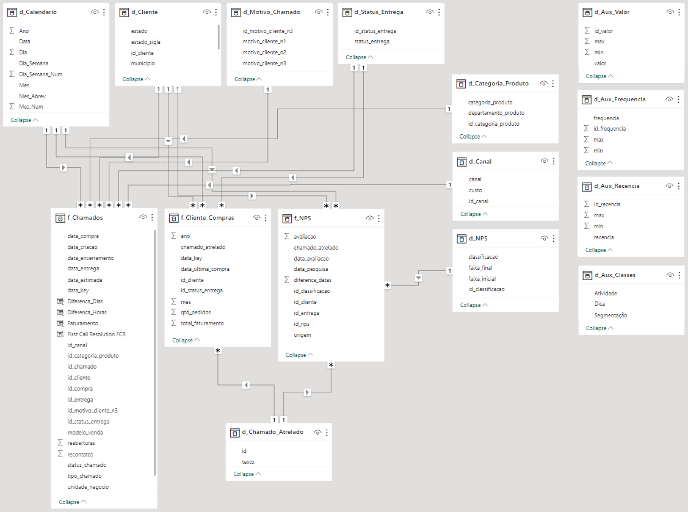
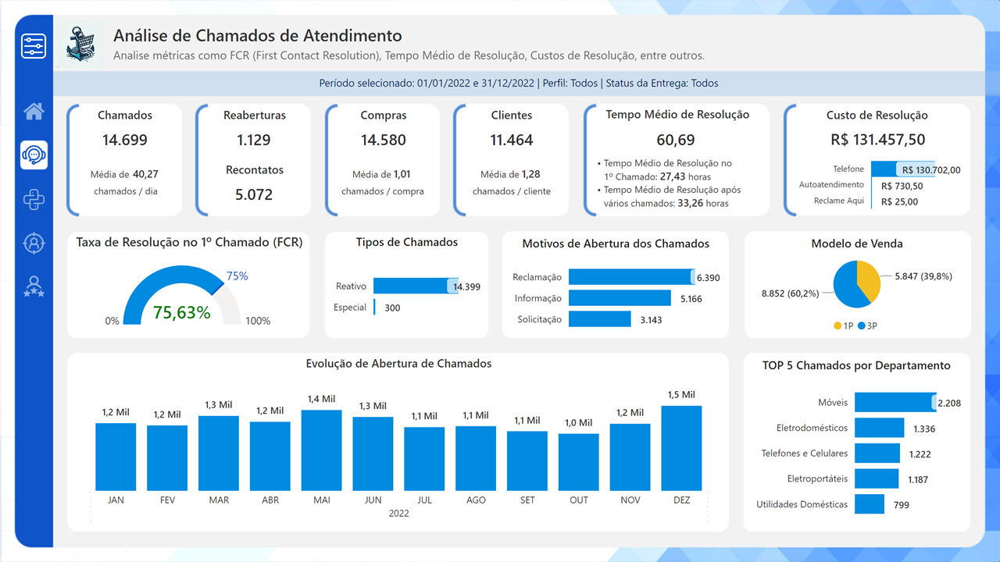
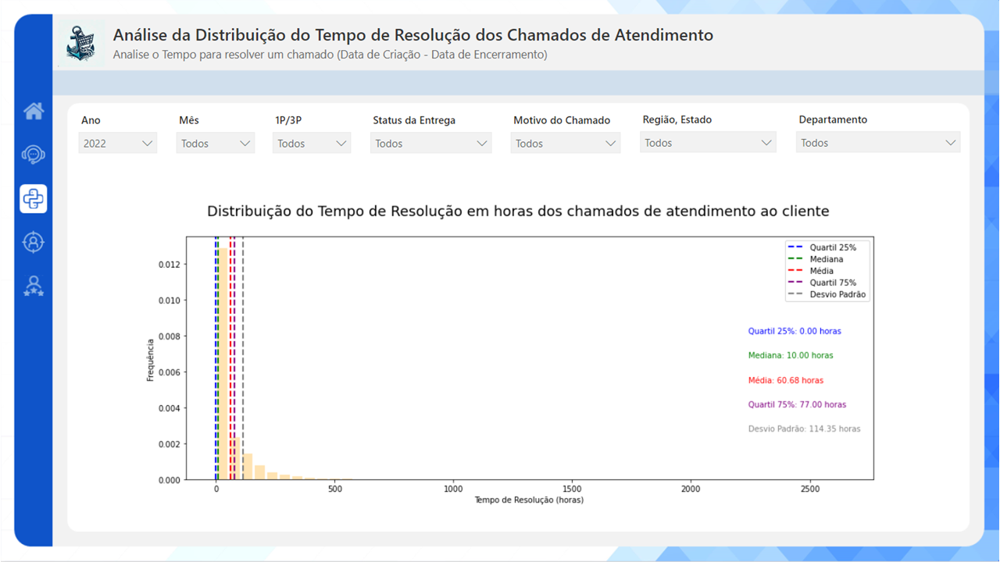
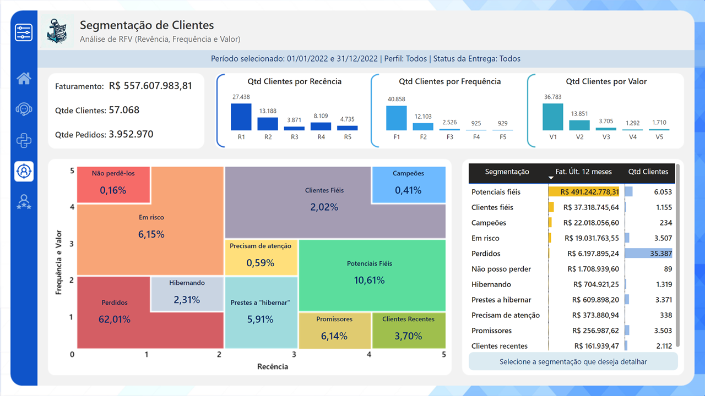
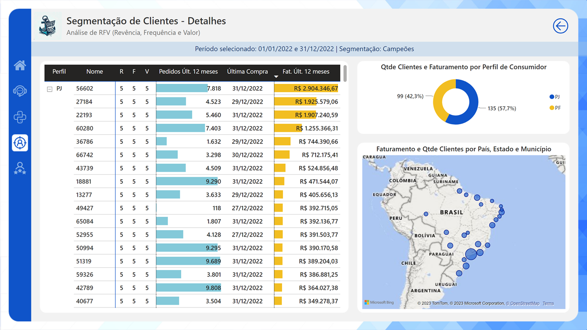
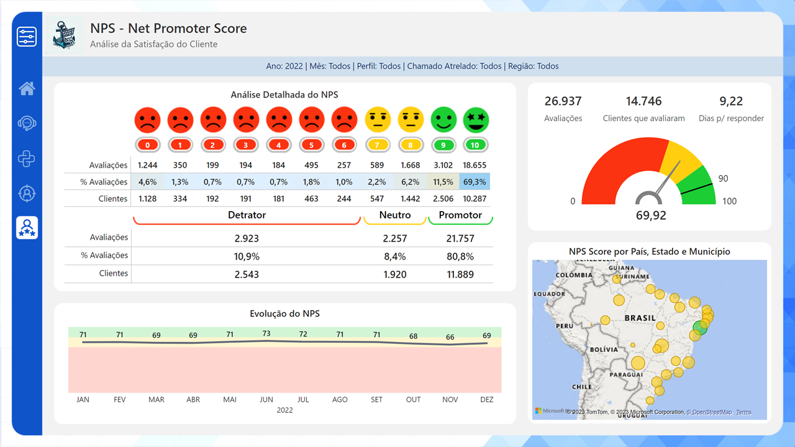

# Projeto de Conclusão da Disciplina "Data Analytics" do MBA em Data Science

Outubro/2023

---

## Índice

<!--ts-->
   * [Descrição do Projeto](https://github.com/adriana-takahagui/mba-data-analytics#descrição-do-projeto)
   * [Descrição do Problema de Negócio](https://github.com/adriana-takahagui/mba-data-analytics#descrição-do-problema-de-negócio)
   * [Dicionário de Variáveis](https://github.com/adriana-takahagui/mba-data-analytics#dicionário-de-variáveis)
   * [Metodologia](https://github.com/adriana-takahagui/mba-data-analytics#metodologia)
   * [Desenvolvimento](https://github.com/adriana-takahagui/mba-data-analytics#desenvolvimento)
     * [Preparação dos dados](https://github.com/adriana-takahagui/mba-data-analytics#preparação-dos-dados)
     * [Tratamento dos Dados no Power Query Editor](https://github.com/adriana-takahagui/mba-data-analytics#tratamentos-dos-dados-no-power-query-editor)
     * [Relacionamento das Tabelas](https://github.com/adriana-takahagui/mba-data-analytics#relacionamento-das-tabelas)
     * [Relatórios e Insights](https://github.com/adriana-takahagui/mba-data-analytics#relatórios-e-insights)
   * [Próximos Passos](https://github.com/adriana-takahagui/mba-data-analytics#próximos-passos)
   * [Fontes e Referências](https://github.com/adriana-takahagui/mba-data-analytics#fontes-e-referências)
<!--te-->

---

## Descrição do Projeto

**Disciplina**: Data Analytics 

**Requisitos**: 

- [X] Objetivo: deve ser bem definido o objetivo do projeto e qual problema de negócio será resolvido.
- [X] Resolver o problema de negócio com aplicação dos conhecimentos dos módulos da disciplina Data Analytics. 
- [X] Tema Livre, preferencialmente um problema corriqueiro da empresa ou área em que atua.
- [X] Power BI: deve-se construir um dashboard em Power BI.
- [X] Python: O dashboard em Power BI deve conter no mínimo um gráfico construído com o Python. O Data Wrangling pode-se utilizar o Python.

---

## Descrição do Problema de Negócio

Esta seção aborda a descrição do problema de negócio escolhido para desenvolver o projeto da disciplina "Data Analytics".

**Tema**:

- Análise de _Customer Service_, _Customer Experience_ e _Customer Satisfaction_ em uma empresa de e-Commerce.

**Objetivo**:

- Melhorar o relacionamento com o cliente em todo o processo de venda, fortalecer a marca com maior presença no mercado, capturar as necessidades do cliente, e melhorar a sua satisfação, tudo isso focando na análise do atendimento ao cliente (_customer service_) e de sua experiência e satisfação na jornada de compra.

**Problema de Negócio**:

- Como toda empresa de e-commerce, a "Online Shopping Harbor"[^1] (nome da empresa fictícia para este projeto) também precisa lidar com o processo de pós venda de seus produtos.
- Assim, a "Online Shopping Harbor" deve ser capaz não somente de atender seus clientes da melhor maneira possível como também inovar com uso de tecnologia, análise de dados e inteligência artificial para que possa sobreviver em um mercado cada vez mais competitivo.
- E para alcançar isso, percebeu-se a necessidade de **_melhorar seu atendimento ao cliente_** para que este possa ter uma **_melhor experiência e satisfação_** na sua jornada e, assim, retornar em outras compras e se tornar um promotor da marca da "Online Shopping Harbor", resultando no aumento da retenção do cliente. 
- Para tanto, uma dashboard em Power BI foi desenvolvido para analisar o problema proposto. 

**Fontes de Dados**:

- Uma amostra aleatória dos dados utilizados na construção deste dashboard foi extraída de um e-commerce abrangendo o período de 2022. Depois, os dados foram anonimizados, tratados e filtrados retirando qualquer aspecto desse e-commerce.    
- Portanto, qualquer semelhança com qualquer cenário de qualquer empresa é pura coincidência. 
- O conjunto de dados em questão é formado pelos arquivos abaixo:
  - **dados_chamados_2022.xlsx**: dados com chamados de atendimento ao cliente 
  - **dados_nps_2022.xlsx**: dados com avaliações da pesquisa NPS
  - **dados_rfv_2022.xlsx**: dados necessários para análise de segmentação de cliente (RFV)
  - **dados_clientes.xlsx**: dados de cadastro de clientes
  - **dados_categoria_produtos.xlsx**: dados de cadastro de categorias e departamentos dos produtos disponibilizados pela "Online Shopping Harbor"

**Link do Dashboard no Power BI**: 

---

## Dicionário de Variáveis

Esta seção descreve as tabelas e as variáveis utilizadas no projeto e no problema proposto.

**Descrição das variáveis com origem em: dados_chamados_2022.xlsx**

|  N |       Variável       | Tipo do Dado |                              Descrição                             |                          Valores Permitidos                          |
|:--:|----------------------|:------------:|--------------------------------------------------------------------|----------------------------------------------------------------------|
|  1 | id_protocolo         |    String    | Identificador alfanumérico único do chamado                        | Não enumerado                                                        |
|  2 | id_cliente           |    String    | Identificador alfanumérico único do cliente                        | Não enumerado                                                        |
|  3 | id_compra            |    String    | Identificador alfanumérico único da compra                         | Não enumerado                                                        |
|  4 | id_entrega           |    String    | Identificador alfanumérico único da entrega                        | Não enumerado                                                        |
|  5 | data_criacao         |  Data e Hora | Data e hora de criação do chamado de atendimento                   | Formato: dd/mm/aaaa hh:mm                                            |
|  6 | data_encerramento    |  Data e Hora | Data e hora do encerramento do chamado de atendimento              | Formato: dd/mm/aaaa hh:mm                                            |
|  7 | id_canal             |    Inteiro   | Identificador do canal de atendimento                              | Número inteiro entre 0 e 8                                           |
|  8 | tipo_chamado         |    String    | Tipo do chamado                                                    | Reativo; Especial                                                    |
|  9 | id_motivo_cliente_n3 |    Inteiro   | Identificador numérico do motivo do chamado de atendimento         | Número inteiro entre 1 a 20, mas novos motivos podem ser adicionados |
| 10 | unidade_negocio      |    String    | Unidade de negócio                                                 | B2C; B2B; Marketplace                                                |
| 11 | modelo_venda         |    String    | Modelo de Venda                                                    | 1P; 3P                                                               |
| 12 | status_chamado       |    String    | Status do chamado                                                  | Resolvido; Não resolvido                                             |
| 13 | recontatos           |    Inteiro   | Quantidade de recontatos realizados pelo cliente neste chamado     | Não enumerado                                                        |
| 14 | reaberturas          |    Inteiro   | Quantidade de reaberturas deste chamado                            | Não enumerado                                                        |
| 15 | id_categoria_produto |    Inteiro   | Identificador numérico da categoria do produto                     | Não enumerado                                                        |
| 16 | valor_venda_unidade  |    Decimal   | Valor unitário de venda do produto adquirido                       | Não enumerado                                                        |
| 17 | valor_frete          |    Decimal   | Valor do frete do produto adquirido                                | Não enumerado                                                        |
| 18 | id_status_entrega    |    Inteiro   | Identificador numérico do status da entrega                        | 1 - Cancelado; 2 - Devolução; 3 - Entregue ao Cliente                |
| 19 | data_compra          |     Data     | Data da compra                                                     | Formato: dd/mm/aaaa                                                  |
| 20 | data_estimada        |     Data     | Data estimada de entrega informada ao cliente no momento da compra | Formato: dd/mm/aaaa                                                  |
| 21 | data_entrega         |     Data     | Data da entrega realizada                                          | Formato: dd/mm/aaaa                                                  |

**Descrição das variáveis com origem em: dados_nps_2022.xlsx**

| N |     Variável     | Tipo do Dado |                                        Descrição                                       |      Valores Permitidos     |
|:-:|------------------|:------------:|----------------------------------------------------------------------------------------|-----------------------------|
| 1 | id_nps           |    String    | Identificador alfanumérico único da pesquisa NPS                                       | Não enumerado               |
| 2 | id_entrega       |    String    | Identificador alfanumérico único da entrega                                            | Não enumerado               |
| 3 | id_cliente       |    String    | Identificador alfanumérico único do cliente                                            | Não enumerado               |
| 4 | data_pesquisa    |     Data     | Data de realização da pesquisa NPS                                                     | Formato: dd/mm/aaaa         |
| 5 | data_avaliacao   |     Data     | Data de avaliação da pesquisa NPS pelo cliente                                         | Formato: dd/mm/aaaa         |
| 6 | avaliacao        |    Inteiro   | Nota de avaliação dada pela entrega do pedido                                          | Número inteiro entre 0 a 10 |
| 7 | origem           |    String    | Origem da pesquisa NPS                                                                 | E-mail; SMS                 |
| 8 | chamado_atrelado |   Booleano   | Indicador se a entrega vinculada à pesquisa NPS tem um chamado de atendimento atrelado | 1 - Sim; 0 - Não            |

**Descrição das variáveis com origem em: dados_rfv_2022.xlsx**

| N |      Variável      | Tipo do Dado |                                     Descrição                                    |                   Valores Permitidos                   |
|:-:|--------------------|:------------:|----------------------------------------------------------------------------------|--------------------------------------------------------|
| 1 | id_cliente         |    String    | Identificador alfanumérico único do cliente                                      | Não enumerado                                          |
| 2 | ano                |    Inteiro   | Ano da data da compra                                                            | Formato do ano com 4 dígitos                           |
| 3 | mes                |    Inteiro   | Mês da data da compra                                                            | Formato do mês em dígitos, ou seja, entre 1 a 12       |
| 4 | id_status_entrega  |    Inteiro   | Identificador do status da entrega                                               | 1 - Cancelado; 2 - Devolução; 3 - Entregue ao Cliente  |
| 5 | qtd_pedidos        |    Inteiro   | Quantidade de pedidos realizado no período indicado pelo Ano e Mês               | Não enumerado                                          |
| 6 | total_faturamento  |    Decimal   | Total de faturamento realizado no período indicado pelo Ano e Mês                | Não enumerado                                          |
| 7 | data_ultima_compra |     Data     | Data da última compra realizada no período indicado pelo Ano e Mês               | Formato: dd/mm/aaaa                                    |
| 8 | chamado_atrelado   |   Booleano   | Indicador se a entrega vinculada à compra tem um chamado de atendimento atrelado | 1 - Sim; 0 - Não                                       |

**Descrição das variáveis com origem em: dados_clientes.xlsx**

| N |   Variável   | Tipo do Dado |                  Descrição                  |                                           Valores Permitidos                                           |
|:-:|--------------|:------------:|---------------------------------------------|--------------------------------------------------------------------------------------------------------|
| 1 | id_cliente   |    String    | Identificador alfanumérico único do cliente | Não enumerado                                                                                          |
| 2 | nome_cliente |    String    | Nome do cliente                             | Dado anonimizado e vinculado a números inteiros entre 10001 e 67392, porém novos clientes podem surgir |
| 3 | perfil       |    String    | Perfil do cliente                           | PF (Pessoa Física); PJ (Pessoa Jurídica)                                                               |
| 4 | municipio    |    String    | Município de localização do cliente         | Conjunto contendo apenas os municípios do Brasil                                                       |
| 5 | estado       |    String    | Estado de localização do cliente            | Conjunto contendo apenas os 26 estados do Brasil                                                       |
| 6 | estado_sigla |    String    | Sigla do estado de localização do cliente   | Conjunto contendo apenas os 26 estados do Brasil formado por 2 caracteres                              |
| 7 | regiao       |    String    | Região de localização do cliente            | 5 regiões do Brasil (Sudeste; Nordeste; Norte; Centro-Oeste; Sul)                                      |
| 8 | pais         |    String    | País de localização do cliente              | Brasil                                                                                                 |

**Descrição das variáveis com origem em: dados_categoria_produtos.xlsx**

| N |       Variável       | Tipo do Dado |                 Descrição                |                Valores Permitidos               |
|:-:|----------------------|:------------:|------------------------------------------|-------------------------------------------------|
| 1 | id_categoria_produto |    Inteiro   | Identificador numérico único do produto  | Não enumerado                                   |
| 2 | departamento_produto |    String    | Departamento a que pertence o produto    | Não enumerado. Novos departamentos podem surgir |
| 3 | categoria_produto    |    String    | Categoria a que pertence o produto       | Não enumerado. Novas categorias podem surgir    |

---

## Metodologia

**1. Entendimento do negócio**  
**Qual a necessidade ou dor do negócio?**
- O case abordado é um e-commerce que vende online diversos tipos de produtos, tanto para consumidores (B2C) quanto para empresas (B2B), possuindo mais de 1.230 categorias de produtos e tendo atuação em todas as 5 regiões do Brasil. Para este projeto, foi extraída uma amostra aleatória de dados abrangendo o período de um ano (2022) e contendo dados de compras de clientes, chamados de atendimento e pesquisa NPS. 
- Neste processo, o consumidor realiza uma compra no site da “Online Shopping Harbor”. Em seguida, realiza o pagamento, e uma data estimada de entrega é apresentada no momento da compra. Tudo seguindo o fluxo normal, a entrega é realizada no endereço indicado. Caso o consumidor tenha qualquer dúvida ou necessite de informações, solicitações ou para realizar qualquer reclamação, ele abre um chamado com a Online Shopping Harbor através dos diversos canais de atendimento como site, email, telefone, app, entre outros. 
- O principal objetivo deste projeto é criar uma análise sobre a performance de atendimento do cliente da "Online Shopping Harbor" no Power BI como apresentado no item “Descrição do Problema de Negócio”. 

**2. Entendimento dos dados**  
**Quais dados estão presentes / são necessários? Os dados estão disponíveis, preparados e tratados?**
- Esta fase envolve olhar os dados disponíveis com cuidado, entendê-los e prepará-los de tal forma que atenda às necessidades de análise proposta e construção do dashboard. Aqui, somente tabelas disponíveis e de interesse foram utilizadas. 

**3. Preparação dos dados**  
**Como os dados foram tratados e preparados para o dashboard?**
- Após o entendimento dos dados, a próxima fase é a preparação dos dados, uma fase muito importante e que toma bastante tempo. Ela é formada por diversas etapas como: transformação dos dados, criação de novas variáveis, agrupamento de dados, entre outras. 
- Nesta fase, foi retirada a amostra aleatória com os dados anonimizados, sumarizados e contemplando o problema proposto. 
- Depois disso, alguns tratamentos foram realizados no Power Query Editor. 

**4. Realização de cálculos para Análise**  
**Quais as medidas e cálculos necessários para análise?**
- Esta fase envolve a criação de medidas DAX para atender as análises e indicadores que irão compor o Dashboard. Aqui, diversas medidas e cálculos foram criados para:
  - Indicadores de chamados de atendimento
  - NPS
  - Segmentação de clientes através da análise RFV

**5. Storytelling**  
**Qual a história por trás dos dados?**
- Esta fase é formada pela elaboração do layout do dashboard e storytelling com dados, dispondo os visuais de tal forma que contem uma história, assim como utilizando os diversos recursos visuais da ferramenta e as possibilidades de design para facilitar a leitura das informações e extração de insights. 

**6. Implementação**  
**Como o dashboard será disponibilizado e os dados atualizados?**
- Uma vez que o dashboard esteja validado e homologado pela área de negócio que irá utilizar no dia a dia, o dashboard poderá ser publicado em uma workspace no Serviço do Power BI e disponibilizado para os usuários finais. 
- Para atualização dos dados, será necessária a instalação de um gateway, caso os arquivos estejam localizados em um servidor local. Caso estejam armazenados na nuvem como uma pasta no SharePoint Online, o gateway não será necessário. 
- A partir daí, uma atualização agendada pode ser configurada para ocorrer diariamente ou conforme a necessidade da área de negócio. 

**7. Acesso ao dashboard**  
**Como a área de negócio irá acessar o resultado (dashboard)?**
- Uma vez que o dashboard esteja disponibilizado, a área de negócio poderá acessá-lo diariamente no Serviço online do Power BI pelo link https://app.powerbi.com/, logando com seu usuário e senha. 
- O dashboard também poderá ser embedado em um portal ou intranet da empresa "Online Shopping Harbor", facilitando o acesso rápido. 

---

## Desenvolvimento 

Esta seção aborda o desenvolvimento e as explicações de cada relatório desenvolvido para auxiliar no problema proposto. 

### Preparação dos Dados 

A maioria dos tratamentos dos dados foi realizada no momento de extração e anomização do dado. Como uma boa prática no Power BI, é recomendável trazer a informação tratada para evitar processamentos desnecessários e/ou pesados no Serviço do Power BI. 
Porém alguns tratamentos foram necessários para ilustrar o uso do Power Query Editor, ferramenta para preparar e tratar o dado no Power BI. 

Os arquivos em formato de Planilhas Excel deram origem às tabelas abaixo: 

|     N    |     Nome do Arquivo                  |     Nome da Tabela         |     Tipo da Tabela    |
|:--------:|--------------------------------------|----------------------------|-----------------------|
|     1    |     dados_chamados_2022.xlsx         |     f_Chamados             |     Fato              |
|     2    |     dados_nps_2022.xlsx              |     f_NPS                  |     Fato              |
|     3    |     dados_rfv_2022.xlsx              |     f_Clientes_Compras     |     Fato              |
|     4    |     dados_clientes.xlsx              |     d_Cliente              |     Dimensão          |
|     5    |     dados_categoria_produtos.xlsx    |     d_Categoria_Produto    |     Dimensão          |

Além do conjunto de dados importado de Planilhas Excel, foi necessária a criação de outras tabelas dentro do Power BI para atender a solução proposta. 

As tabelas são: 

|     N     |     Nome da Tabela        |     Criada em      |     Objetivo                                                 |
|:---------:|---------------------------|:------------------:|--------------------------------------------------------------|
|     1     |     d_Aux_Classes         |     Power Query    |     Utilizada no   relatório de "Segmentação de Clientes"    |
|     2     |     d_Aux_Frequencia      |     Power Query    |     Utilizada no   relatório de "Segmentação de Clientes"    |
|     3     |     d_Aux_Recencia        |     Power Query    |     Utilizada no   relatório de "Segmentação de Clientes"    |
|     4     |     d_Aux_Valor           |     Power Query    |     Utilizada no   relatório de "Segmentação de Clientes"    |
|     5     |     d_Calendario          |     DAX            |     Tabela com datas   para relacionar as 3 tabelas fato     |
|     6     |     d_Canal               |     Power Query    |     Descrição dos canais   de atendimento                    |
|     7     |     d_Chamado_Atrelado    |     Power Query    |     Descrição se há um   chamado atrelado ou não             |
|     8     |     d_Motivo_Chamado      |     Power Query    |     Descrição dos   motivos do chamado                       |
|     9     |     d_NPS                 |     Power Query    |     Criada para atender   o relatório de NPS                 |
|     10    |     d_Status_Entrega      |     Power Query    |     Descrição dos status   da entrega                        |

### Tratamentos dos Dados no Power Query Editor

Abaixo seguem os tratamentos realizados no Power Query: 

Tabela "f_Chamados": 
- Criação da coluna "data_key" a partir da coluna "data_criacao" (datetime) no formato apenas data para relacionamento com a tabela d_Calendario. 

Tabela "f_Clientes_Compras": 
- Criação da coluna "data_key" a partir das colunas "ano" e "mês" para relacionamento com a tabela d_Calendario. 

Tabela "f_NPS": 
- Criação da coluna "id_classificacao" para relacionamento com a tabela "d_NPS", utilizada para construir o visual no relatório "NPS - Net Promoter Score". 
- Criação da coluna "diferenca_datas" para calcular o tempo médio de resposta do cliente. 

### Relacionamento das Tabelas

De acordo com a preparação e o tratamento especificados acima, a imagem abaixo apresenta a configuração final do relacionamento de todas as tabelas utilizadas na construção do dashboard.

### Relatórios e Insights

Este dashboard é formado por 5 páginas:
- Página Inicial
- Análise de Chamados de Atendimento 
- Análise da Distribuição do Tempo de Resolução dos Chamados de Atendimento
- Segmentação de Clientes 
- NPS - Net Promoter Score

A página **"Página Inicial"** traz as principais informações resumidas a respeito do dashboard, assim como o link para este documento.[^2]

A página **"Análise de Chamados de Atendimento"** traz uma visão geral dos principais indicadores de atendimento ao cliente como: 
- FCR (First Contact Resolution): indica a porcentagem de interações do cliente que são resolvidas na primeira tentativa de contato
- Tempo Médio de Resolução em horas
- Custo de Resolução por canal de atendimento 
- Motivos de Abertura do Chamado 
- Evolução de Abertura de Chamados ao longo do ano de 2022
- Principais departamentos que receberam mais chamados 
- Entre outros.

Podemos verificar que ao longo do ano de 2022, no geral, tiveram alguns picos de abertura de chamados que coincidem com datas comemorativas como no mês de maio (Dia das Mães) e no mês de novembro/dezembro (Black Friday), um comportamento esperado para empresas de varejo, pois o volume de pedidos também aumenta. 

A Taxa de Resolução geral no 1º Chamado (FCR) é de 75,63%, uma taxa aceitável, sendo que para PF (Pessoa Física) ficou em torno de 72,11% (abaixo da meta esperada de 75%) e para PJ (Pessoa Jurídica) ficou em torno de 83,27%. 

Já a respeito do tempo médio de resolução geral, em média, leva 60,69 horas por chamado, ou seja, mais de 2,5 dias para resolver um problema ou alguma solicitação. Mas, analisando por perfil, vemos que PF (Pessoa Física) possui um desempenho pior (72,73 horas) e PJ (Pessoa Jurídica) possui um desempenho melhor (34,56 horas), apesar da menor quantidade de clientes (1.473 clientes, ou seja, 12,85% de clientes considerando o período de 2022). 

Além disso, foram abertos 5.166 chamados (35,15%) por busca de informação, um indicativo para melhorar a qualidade e a disposição da informação no site ou app do e-commerce. 

A página **"Análise da Distribuição do Tempo de Resolução dos Chamados de Atendimento"** possui um visual criado em Python. No caso, foi criado um histograma com a distribuição de tempo de resolução dos chamados em hora, que seria a diferença entre a Data de Criação e a Data de Encerramento do chamado, com marcadores de quartil 25% (ou seja, um quarto dos dados), mediana (quartil 50%) (ou seja, metade dos dados), média, quartil 75% (ou seja, três quartos dos dados) e desvio padrão. 

Pelo formato do histograma com um cauda longa à direita, podemos perceber claramente a existência de outliers, assim como a grande diferença entre os valores da mediana e da média, ou seja, existem chamados cujo tempo de resolução difere bastante do comportamento padrão (ou seja, extrapolam o intervalo interquartil). 

_Observação_: Até o momento de desenvolvimento deste projeto, não há suporte para os visuais do Python nos relatórios publicados na Web, por esse motivo, o gráfico não é renderizado.  
Link para documentação da Microsoft: https://learn.microsoft.com/pt-br/power-bi/collaborate-share/service-publish-to-web

A página **"Segmentação de Clientes"**[^3] possui análise de segmentação do cliente baseado no modelo RFV (Recência, Frequência e Valor) com o intuito de entender e comparar o comportamento do cliente (comparar clientes que não precisaram de atendimento e clientes que abriram um chamado de atendimento, seja para reclamar, informar-se ou solicitar algo). 

O modelo RFV é definida como: 
- **R (Recência)**: período desde a última compra (valor menor significa uma maior probabilidade de o cliente repetir pedidos e são clientes mais propensos a promoções)
- **F (Frequência)**: número de compras realizadas dentro de um certo período (alta frequência significa maior lealdade, clientes mais engajados e satisfeitos) 
- **V (Valor)**: valor gasto nas compras dentro de um certo período (aqui é possível diferenciar clientes que gastam pesadamente de compras de baixo valor)

Como regra de negócio, foram definidos os seguintes valores para estes parâmetros:

Recência: Qual o período da última compra? 
- R1: acima de 180 dias
- R2: entre 90 e 180 dias 
- R3: entre 65 e 90 dias
- R4: entre 30 e 65 dias
- R5: últimos 30 dias

Frequência: Quantas compras foram realizadas nos últimos 12 meses? 
- F1: entre 0 e 2 compras  
- F2: entre 2 e 5 compras 
- F3: entre 5 e 9 compras 
- F4: entre 9 e 14 compras
- F5: mais de 14 compras 

Valor: Qual o valor gasto nos últimos 12 meses? 
- V1: entre R$ 0 e R$ 250 
- V2: entre R$ 250 e R$ 750 
- V3: entre R$ 750 e R$ 1500
- V4: entre R$ 1500 e R$ 2500
- V5: acima de R$ 2500 

Além disso, o relatório apresenta uma matriz de segmentação de clientes conforme tabela abaixo:

|  Segmentação         |  Atividade                                                                                             |  Dica                                                                                                                                  |  R           |  (F + V) / 2  |
|----------------------|--------------------------------------------------------------------------------------------------------|----------------------------------------------------------------------------------------------------------------------------------------|:------------:|:-------------:|
|  Campeões            |  Comprou recentemente. Compra com frequência. E gasta muito!                                           |  Recompense-os. Podem ser os primeiros a adotar novos produtos. Irá promover a sua marca.                                              |  > 4         |  > 4          |
|  Clientes fiéis      |  Gasta um bom dinheiro. Compra frequentemente.                                                         |  Produtos de maior valor agregado. Peça opiniões. Envolva-os.                                                                          |  > 2         |  > 3          |
|  Potenciais fiéis    |  Clientes recentes. Gastaram uma boa quantia. Compraram mais de uma vez.                               |  Ofereça programa de associação / fidelidade, recomende outros produtos.                                                               |  > 3         |  > 1 e < 3    |
|  Clientes recentes   |  Comprou recentemente. Mas não com frequência.                                                         |  Forneça suporte de integração, dê-lhes sucesso antecipado e comece a construir um relacionamento.                                     |  > 4         |  > 0 e <= 1   |
|  Promissores         |  Compradores recentes. Mas não gastaram muito.                                                         |  Crie reconhecimento da marca, ofereça testes gratuitos.                                                                               |  > 3 e <= 4  |  > 0 e <= 1   |
|  Precisam de atenção |  Recência, frequência e valores monetários acima da média. (Pode não ter comprado muito recentemente). |  Faça ofertas por tempo limitado, recomende com base em compras anteriores. Reative-os.                                                |  > 2 e <= 3  |  > 2 e <= 3   |
|  Prestes a hibernar  |  Abaixo da média da Recência, Frequência e Valores Monetários. (Perderá se não for reativados).        |  Compartilhe recursos valiosos, recomende produtos / renovações populares com desconto, reconecte-se a eles.                          |  > 2 e <= 3  |  > 0 e <= 2   |
|  Em risco            |  Gastou muito dinheiro e comprou com frequência. Mas há muito tempo. (Precisa trazê-los de volta)!     |  Envie e-mails personalizados para se reconectar, ofereça renovações, forneça recursos úteis.                                          |  > 0 e <= 2  |  > 2          |
|  Não posso perder    |  Fez grandes compras e com frequência. Mas há algum tempo.                                             |  Conquiste-os de volta através de renovações ou produtos mais recentes, não os perca para a   concorrência, converse com eles. |  > 0 e <= 1  |  > 4          |
|  Hibernando          |  A última compra foi feita há algum tempo. Pouco gasto e baixo número de pedidos.                      |  Ofereça outros produtos relevantes e descontos especiais. Recrie o valor da marca.                                                    |  = 2         |  = 2          |
|  Perdidos            |  Recência, frequência e pontuação monetária mais baixas.                                               |  Reviva o interesse com uma campanha de alcance, caso contrário, ignore.                                                               |  < 2         |  < 2          |

Quando não existe um chamado atrelado a compra, percebemos 0,01% de campeões, 0,62% de clientes fiéis, 7,30% de potenciais fiéis e 68,44% de clientes perdidos.  

Já quando analisamos compras com chamado atrelado, ou seja, o consumidor necessitou de alguma assistência na jornada de compra, temos 2,06% de campeões, 7,81% de clientes fiéis, 24,23% de potenciais fiéis e 34,48% de clientes perdidos. 

Aqui conseguimos ver uma diferença interessante, quase uma redução de 50% em clientes perdidos quando o consumidor abre um chamado.   
Isso mostra a importância de possuir um bom serviço de atendimento ao cliente em toda a jornada de compra do consumidor. 

Verificando o detalhe de formação de cada segmentação: quais os clientes estão presentes nessa segmentação, regiões, e tipo de consumidor.

A página **"NPS - Net Promoter Score"** traz uma análise da métrica NPS, muito utilizada para mensurar o nível de satisfação do cliente em relação à experiência de compra e entrega do produto. 

Ela é obtida através de uma pesquisa em que se faz apenas uma pergunta: "Em uma escala de 0 a 10, o quanto você indicaria a empresa "Online Shopping Harbor" a um amigo ou colega?", que tem, portanto, como reposta uma nota entre 0 a 10. 

De acordo com a resposta dada, o cliente é classificado em 3 grupos distintos: 
- Promotores (aqueles que avaliaram com uma nota 9 ou 10): são clientes fieis que recomendam a empresa 
- Neutros (aqueles que avaliaram com uma nota 7 ou 8): clientes satisfeitos, mas que não engajam com a empresa 
- Detratores (aqueles que avaliaram com uma nota 0 a 6): clientes insatisfeitos que criticam a empresa para amigos e familiares
Para o cálculo do NPS, basta calcular a % de promotores e a % de detratores e realizar a subtração entre os valores obtidos. 

No caso da "Online Shopping Harbor", vemos que a concentração de respostas se encontra nas notas 9 e 10, apesar disso, o NPS é de aproximadamente 70, média mantida ao longo do ano de 2022. Isso só mostra que a empresa precisa melhorar em relação à satisfação do cliente. 
                                     
Ao contrário da análise de segmentação de clientes, consumidores que abriram chamado e responderam à pesquisa NPS resultam em uma nota muito baixa, pois o número de detratores é maior que o número de promotores. Porém, somente 1.132 avaliações foram realizadas, em torno de 4,2% do total. 

Já aqueles que não abriram chamado e responderam à pesquisa NPS resultam em um nota melhor, em torno de 73,53. 

---

## Próximos Passos

Como próximos passos e continuidade deste projeto, sugiro:
- Com os insights obtidos, criar uma página de recomendações e sugestões de ações para melhorar o atendimento ao cliente
- Criar análises avançadas, talvez utilizando Machine Learning, para entender melhor o perfil do cliente quano este busca alguma ajuda no SAC da empresa 

---

## Fontes e Referências

Esta seção disponibiliza as fontes e as referências utilizadas para o desenvolvimento do projeto. 

[^1]: Nome escolhido com uso do ChatGPT 

[^2]: A imagem no canto superior esquerdo é a logo da empresa fictícia "Online Shipping Harbor", criada utilizando "Image Creator from Microsoft Bing" (https://www.bing.com/create/)

[^3]: O desenvolvimento da análise RFV foi baseada no seguinte conteúdo: https://powerbiexperience.com/pt/blog/usando-dax-para-segmentar-clientes-por-rfv-recencia-frequencia-e-valor/
